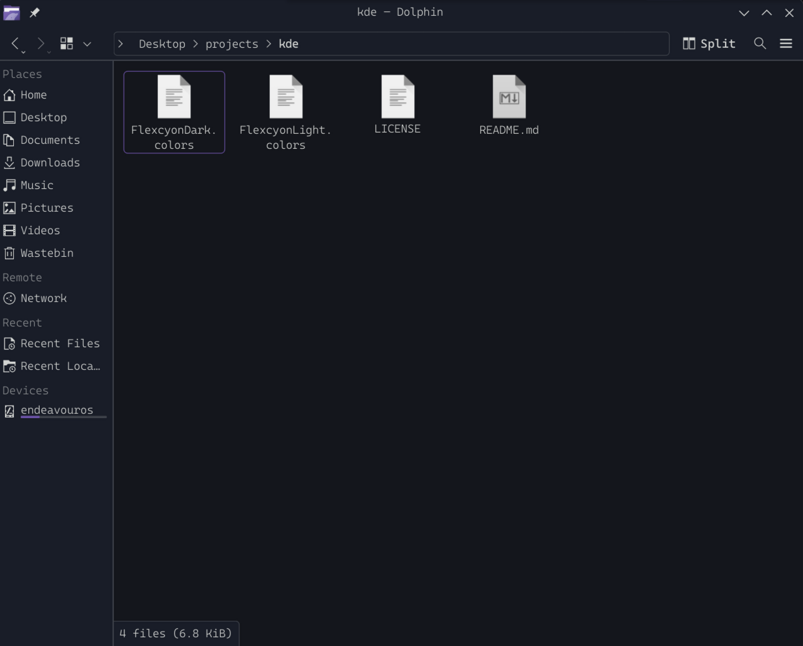
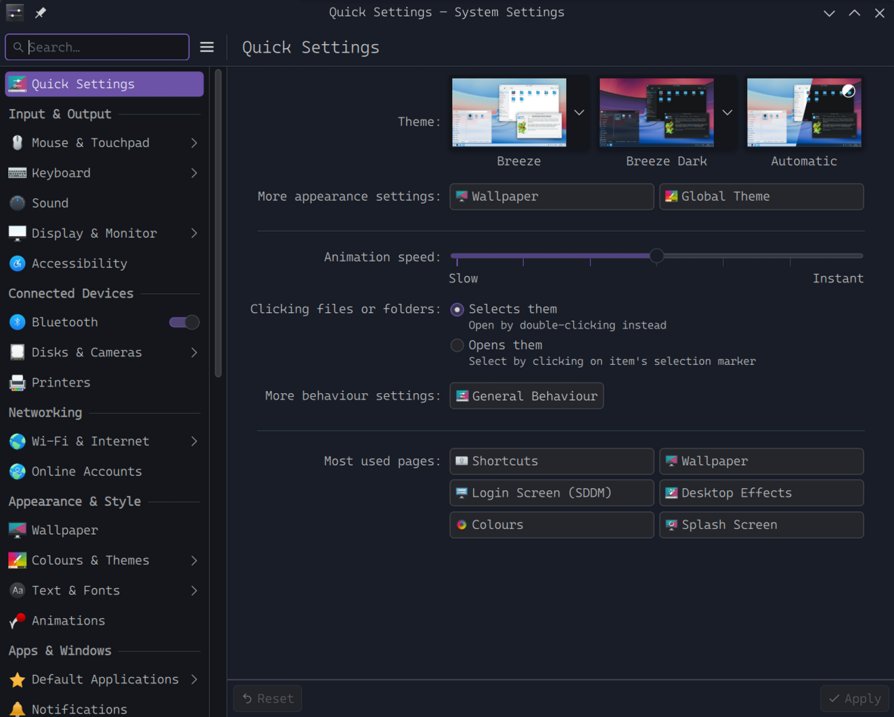
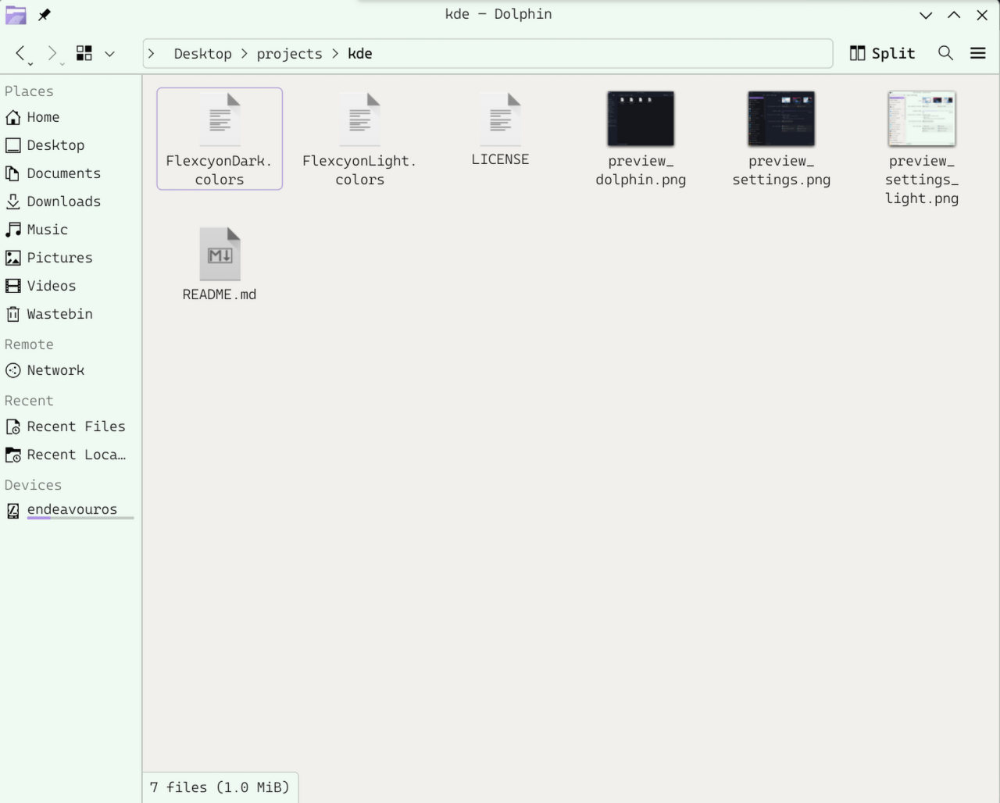
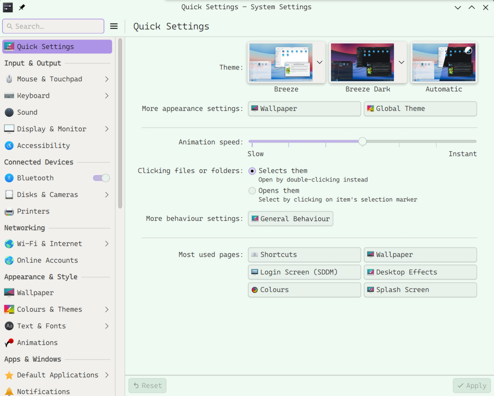

# About Flexcyon

| Colour Scheme | Application | Preview |
| --- | --- | --- |
| flexcyon dark | Dolphin |  |
| flexcyon dark | Settings |  |
| flexcyon light | Dolphin |  |
| flexcyon light | Settings |  |

This is a KDE port of the Obsidian.md theme
Flexcyon. It combines the colour schemes of Halcyon and Flexoki.

### Why I made the theme

> I really liked the vibrant colours of the
> [Halcyon colour scheme](https://halcyon-theme.netlify.app/), and the inky
> aesthetic of the [Flexoki colour scheme](https://stephango.com/flexoki). Hence,
> I decided to combine the two which started this theme.

You can find out more about [the Obsidian.md theme here](https://github.com/bladeacer/flexcyon).

## Installation

### Manual download

1. Download from [opendesktop.org](https://www.opendesktop.org/p/2365891/)
2. Copy the `.colors` files to `~/.local/share/color-schemes/`
3. Select them in **System Settings** -> **Colors**

## License

[MIT](./LICENSE), just like the original theme.
